# Lab Report 4 - Vim (Week 7)

- This was what the fork looked like before I committed the changes to my Github account:

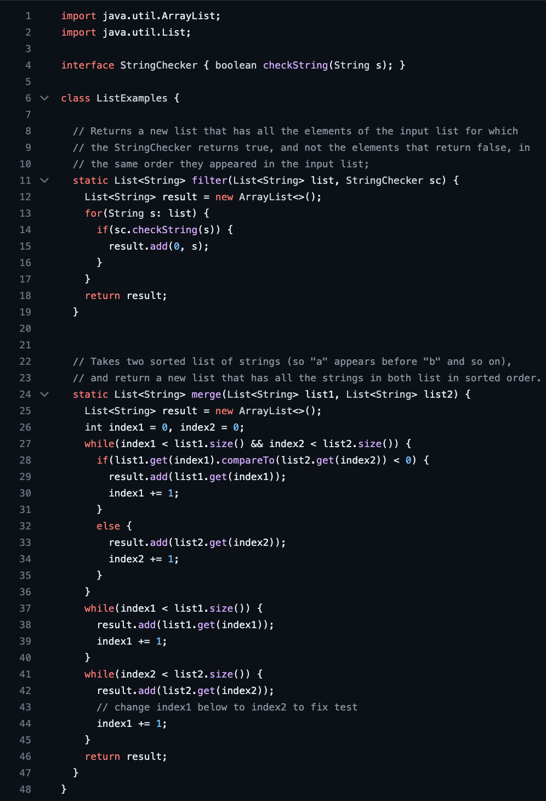

## 4. Log into ieng6:
- First, key press `<up>` arrow for 2 times to find `ssh cs15lfa23nn@ieng6.ucsd.edu` command from the history, then press `<enter>`:

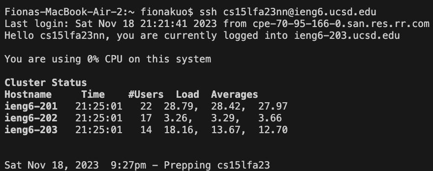

## 5. Clone your fork of the repository from your Github account (using the SSH URL):
- After the previous step, key press `<up>` arrow for 8 times to find SSH URL `git@github.com:yfkuo/lab7.git` command from the history, then press `<enter>`:

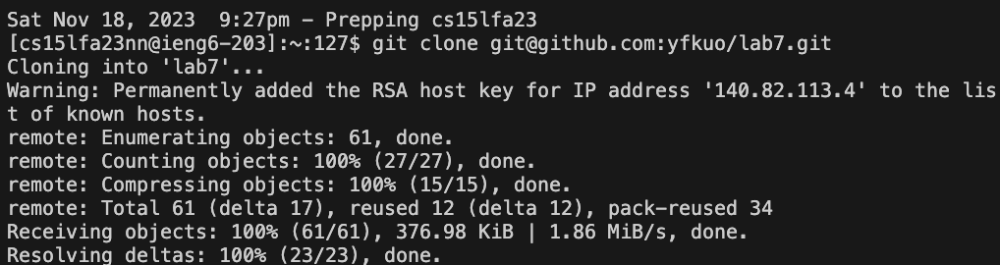

## 6. Run the tests, demonstrating that they fail:
- Next, key press `<down>` arrow for 1 times to find `cd lab7` command from the history, then press `<enter>` to change current working directory to `lab7`.
- Next, then key press `<down>` arrow for 1 times to find `bash test.sh` command from the history, then press `<enter>` to run the tests.
- Image demonstrates the tests failures:

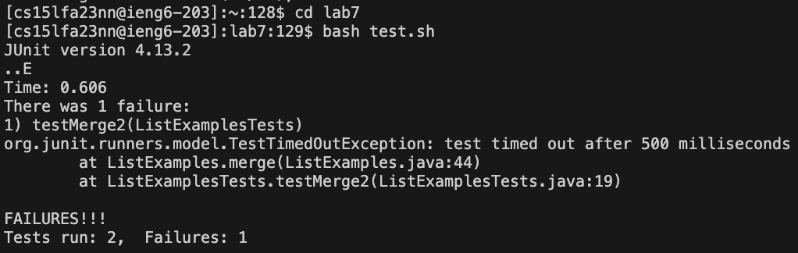

## 7. Edit the code file to fix the failing test:

- Next, key press `<down>` arrow for 1 times to find `vim ListExamples.java` command from the history, then press `<enter>` to edit `ListExamples.java`.

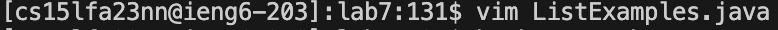

- Next, to find `index1` in `ListExamples.java`: Type `/index1`, then press `<enter>` to select the first found `/index1` in the java file.

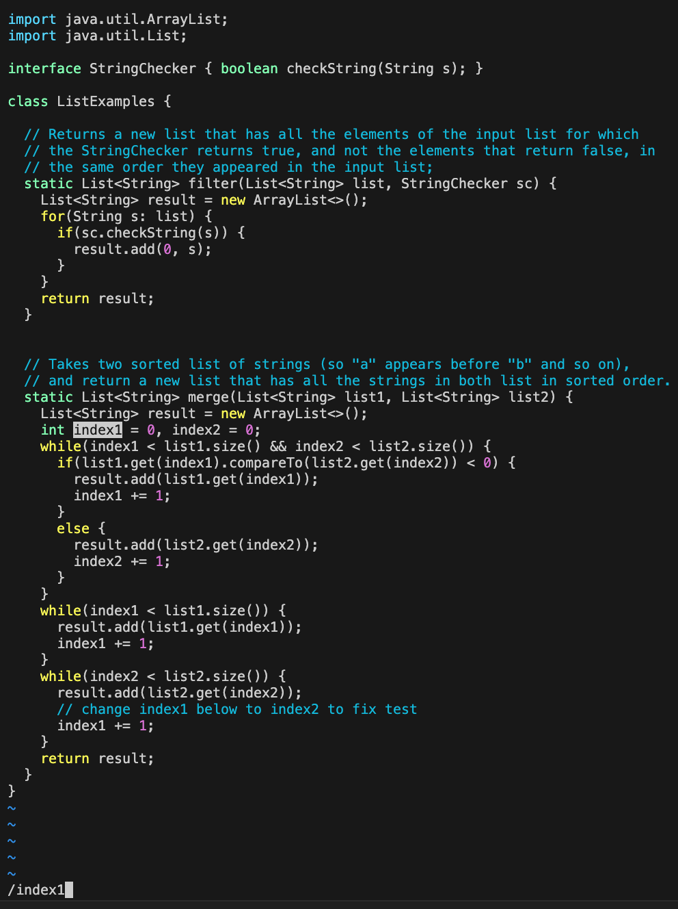

- Next, press `<n>` for 9 times to get to the desired `index1` that we want to change to `index2`.
- Note that the lower right corner will show the number of the line that you are currently at, which is line 44.

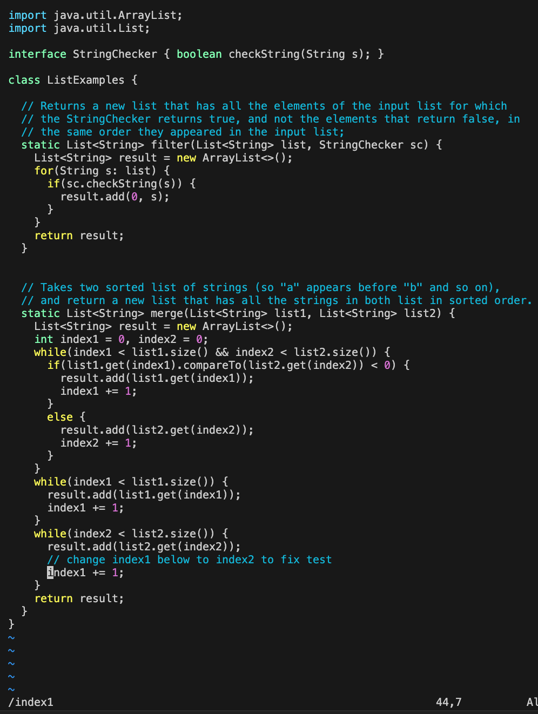

- Next, type `:44s/index1/index2` to select `index1` on line 44.

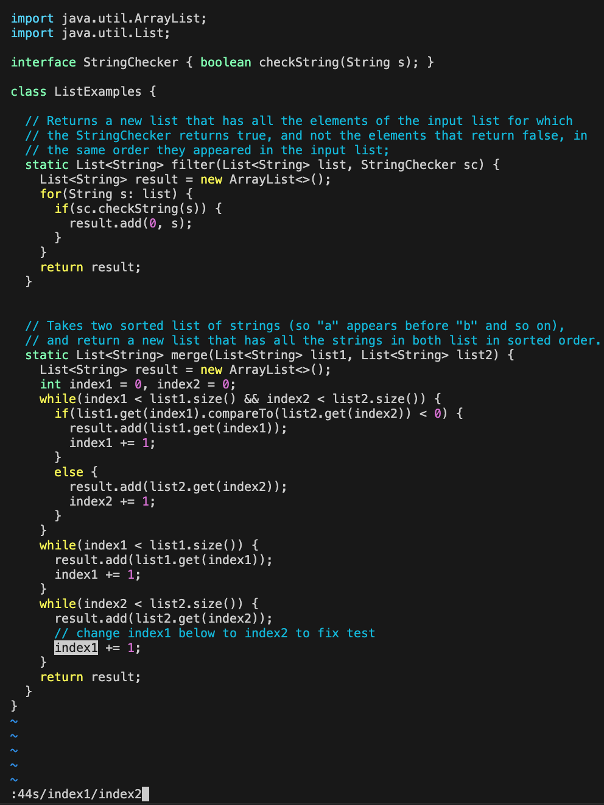

- Next, press `<enter>` after typing `:44s/index1/index2` to change `index1` on line 44 to `index2`.

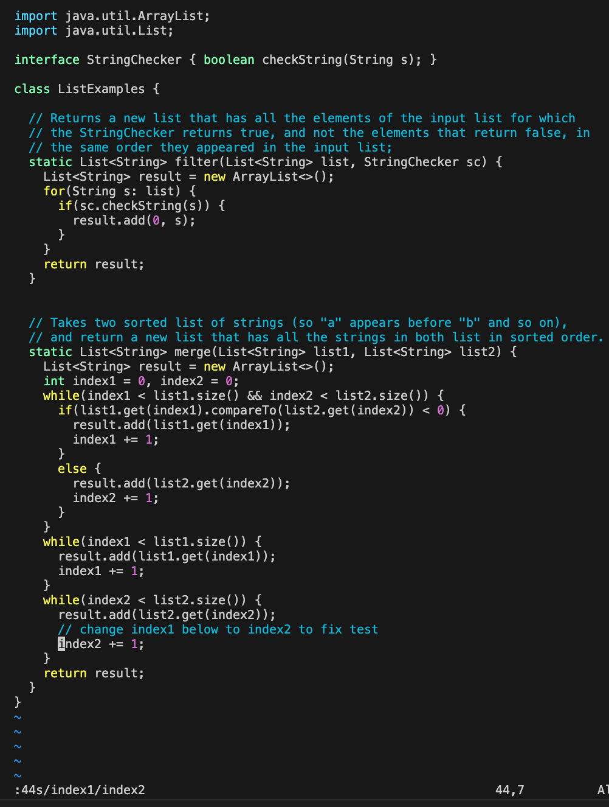

- Next, to save the changes and quit from `vim ListExamples.java`, type `:wq!` then press `<enter>`.

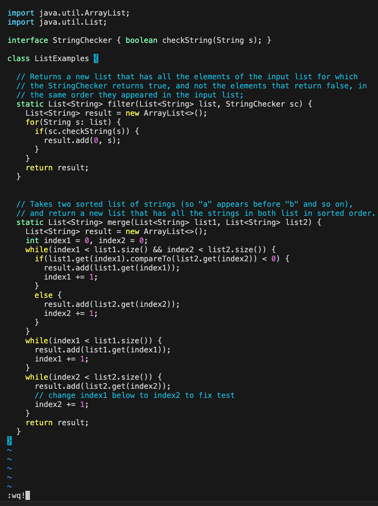

## 8. Run the tests, demonstrating that they now succeed:
- Next, key press `<down>` arrow for 1 times to find `bash test.sh` command from the history, then press `<enter>` to run the tests again.

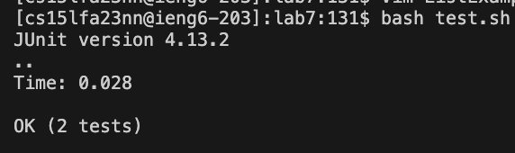

## 9. Commit and push the resulting change to your Github account, type in the following commands:
- Next, key press `<down>` arrow for 1 times to find `git add ListExamples.java` command from the history, then press `<enter>` to add changes.
- Next, key press `<down>` arrow for 1 times to find `git commit -m "update ListExamples.java"` command from the history, then press `<enter>` to commit the changes.
- Next, key press `<down>` arrow for 1 times to find `git push origin main` command from the history, then press `<enter>` to push committed changes back to the repository I forked to my Github account.

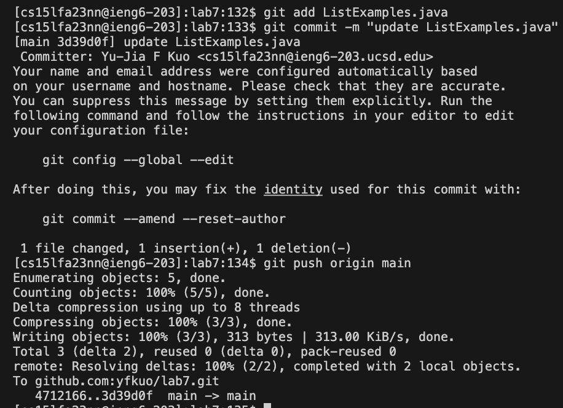

- Now, this image demonstrate the change has sucessfully made to my Github account:

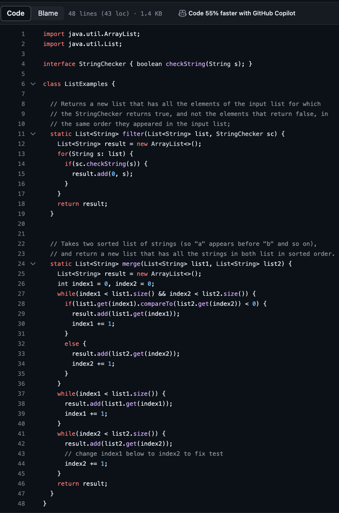

  
